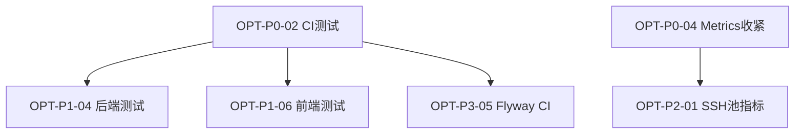

# CloudOps 优化任务清单（Agent 执行版）

> 基于 2026-07-12 全项目评审产出。  
> 配套 Prompt：`docs/agent-optimization-prompt.md`  
> 仓库：https://github.com/kamineayaka/CloudOps  
> **架构重构（包边界/依赖/状态模型）见独立清单：** [`docs/architecture-refactor-todo.md`](architecture-refactor-todo.md)（`ARCH-*`）。与本文件重叠时（如 `user_assets`、权限模型），以 ARCH-A0 决策为准。

**使用方式：**

1. 阅读 `docs/agent-optimization-prompt.md` 了解执行约束与验证命令。
2. 按 **P0 → P1 → P2 → P3** 顺序领取任务；同一优先级内可并行不同模块（backend / frontend / deploy）。
3. 每项任务单独 commit，commit message 格式：`fix(scope): OPT-XX 简短说明`。
4. 完成后将对应 `[ ]` 改为 `[x]`，并在 PR 描述中引用任务 ID（如 `OPT-P0-03`）。
5. 合并前必须跑通验证命令（见 Prompt 文件）。

**任务 ID 前缀：** `OPT-P0-XX` / `OPT-P1-XX` / `OPT-P2-XX` / `OPT-P3-XX`

---

## 执行状态总览

| 等级 | 含义 | 任务数 | 完成 |
|------|------|--------|------|
| P0 | 安全 / 生产阻断 | 6 | 1 |
| P1 | 质量 / 可靠性 | 6 | 0 |
| P2 | 性能 / 架构 / 运维 | 7 | 0 |
| P3 | 体验 / 代码整洁 | 5 | 0 |

---

## P0 — 安全与生产阻断（必须优先）

### [ ] OPT-P0-01 — 重建 RAG 向量索引

| 字段 | 内容 |
|------|------|
| **问题** | `V5__rag_flexible_vector.sql` 删除了 `idx_kb_chunks_embedding` 但未重建，语义检索将退化为全表扫描 |
| **涉及文件** | `backend/src/main/resources/db/migration/V9__recreate_kb_embedding_index.sql`（新建） |
| **实现要点** | 新建 Flyway 迁移，按当前 `vector` 列类型创建 HNSW 或 IVFFlat 索引（`vector_cosine_ops`）；若用 IVFFlat，lists 参数需注释说明调优方式 |
| **完成标准** | `./mvnw flyway:validate` 或启动时 Flyway 成功；`EXPLAIN` 对 `KbChunkVectorRepository.searchSimilar` 的查询显示索引扫描 |
| **测试** | 可选：集成测试插入若干 chunk 后断言 search 返回结果 |
| **依赖** | 无 |

---

### [x] OPT-P0-02 — CI 启用后端测试

| 字段 | 内容 |
|------|------|
| **问题** | `.github/workflows/ci.yml` 使用 `-DskipTests`，已有 Testcontainers 集成测试从未在 CI 运行 |
| **涉及文件** | `.github/workflows/ci.yml` |
| **实现要点** | 移除 `-DskipTests`，改为 `./mvnw -B verify`；若 Testcontainers 需 Docker，确保 `ubuntu-latest` runner 可用（GitHub hosted 默认支持） |
| **完成标准** | CI backend job 执行全部 4+ 测试并通过；`docs/TODO.md` P0-4 描述与 CI 行为一致 |
| **测试** | 本地 `./mvnw verify` 全绿 |
| **依赖** | 无 |

---

### [ ] OPT-P0-03 — 非 dev 环境密钥 fail-fast

| 字段 | 内容 |
|------|------|
| **问题** | `application.yml` 含默认 JWT secret；生产误部署风险高 |
| **涉及文件** | `backend/src/main/java/com/cloudops/common/bootstrap/SecretBootstrapConfig.java` 或新建 `ProductionSecretValidator.java`；`application-compose.yml`、`application-k8s.yml` |
| **实现要点** | 在 `compose` / `k8s` profile 启动时：若 JWT secret 或 credentials master key 为已知弱默认值或为空且无法从 env/文件加载，则 `fail-fast` 并打印明确错误；dev profile 保持现状 |
| **完成标准** | compose profile 无有效密钥时启动失败；设置 env 后正常启动；单测覆盖校验逻辑 |
| **测试** | 新增单元测试：弱密钥 → 异常；合法密钥 → 通过 |
| **依赖** | 无 |

---

### [ ] OPT-P0-04 — 收紧 Prometheus / Actuator 暴露

| 字段 | 内容 |
|------|------|
| **问题** | `/actuator/prometheus` 在 `SecurityConfig` 为 `permitAll`，Nginx 也代理 `/actuator/` |
| **涉及文件** | `backend/src/main/java/com/cloudops/common/config/SecurityConfig.java`；`frontend/nginx.conf`；`docs/deployment.md` |
| **实现要点** | 方案 A（推荐）：Spring Security 对 `/actuator/prometheus` 要求 ADMIN 角色或独立 Bearer token；方案 B：Nginx 对 `/actuator/` 仅允许内网 IP。同步更新部署文档 |
| **完成标准** | 未授权请求无法获取 metrics；健康检查 `/actuator/health/liveness` 仍可用于 Compose healthcheck |
| **测试** | MockMvc 或集成测试：匿名访问 prometheus → 401/403 |
| **依赖** | 无 |

---

### [ ] OPT-P0-05 — WebSocket 鉴权加固

| 字段 | 内容 |
|------|------|
| **问题** | JWT 通过 URL `?token=` 传递；握手硬编码 `ROLE_USER`，未加载真实 RBAC |
| **涉及文件** | `backend/src/main/java/com/cloudops/common/websocket/WebSocketAuthHandshakeInterceptor.java`；`frontend/src/api/aiStream.ts`；`frontend/src/views/TerminalView.vue` |
| **实现要点** | 1) 后端：握手时通过 `UserDetailsService` 加载真实角色与权限；2) 前端：优先使用 `Sec-WebSocket-Protocol` 传 token，或新增 `POST /api/auth/ws-ticket` 换取短期 ticket（≤60s）再连接；3) 移除 query string 传 token（可保留短期兼容并打 deprecation 日志） |
| **完成标准** | VIEWER 无法连接需 OPERATOR 权限的 WS 端点；token 不出现在 URL；现有终端与 AI 流式对话功能正常 |
| **测试** | 集成测试或手动验证：不同角色连接 `/ws/terminal`、`/ws/ai` |
| **依赖** | 无 |

---

### [ ] OPT-P0-06 — 落地资产级 ACL（user_assets）

| 字段 | 内容 |
|------|------|
| **问题** | `user_assets` 表存在但 Java 层未实现；任意 OPERATOR 可访问所有资产 |
| **涉及文件** | 新建 `backend/src/main/java/com/cloudops/asset/domain/UserAsset.java`、`UserAssetRepository.java`；修改 `AssetService.java`、`AssetController.java`；可选 admin API 分配资产 |
| **实现要点** | 1) ADMIN 可见全部资产；2) OPERATOR/VIEWER 仅可见 `user_assets` 中分配的资产；3) 未分配时 OPERATOR 行为需明确（建议：ADMIN 分配前不可见，或文档说明默认全可见仅 dev）；4) `list_assets` 内置工具同步过滤 |
| **完成标准** | 集成测试：用户 A 无法通过 API/内置工具访问未分配资产；ADMIN 可分配 |
| **测试** | 新增 `AssetAclIntegrationTest` |
| **依赖** | 无 |

---

## P1 — 质量与可靠性

### [ ] OPT-P1-01 — 审批职责分离（四眼原则）

| 字段 | 内容 |
|------|------|
| **问题** | 请求者可审批自己的 HIGH 风险操作 |
| **涉及文件** | `backend/src/main/java/com/cloudops/approval/service/ApprovalService.java`；`ApprovalController.java` |
| **实现要点** | `decide()` 校验 `approverId != requesterId`；HIGH 风险仅 `ROLE_ADMIN` 可批准；返回明确业务错误码 |
| **完成标准** | 单测 + 集成测试覆盖自批拒绝、跨用户批准 |
| **依赖** | 无 |

---

### [ ] OPT-P1-02 — 统一后端异常处理

| 字段 | 内容 |
|------|------|
| **问题** | 无 `AccessDeniedException` 处理器；`handleGeneric` 无日志 |
| **涉及文件** | `backend/src/main/java/com/cloudops/common/exception/GlobalExceptionHandler.java` |
| **实现要点** | 新增 `@ExceptionHandler(AccessDeniedException.class)` 返回 `ApiResponse` 403；`handleGeneric` 记录 `log.error`；JWT filter 解析失败记 warn |
| **完成标准** | `@PreAuthorize` 失败返回 JSON 信封；500 错误有服务端日志 |
| **测试** | MockMvc 测试无权限访问 → 403 + 统一格式 |
| **依赖** | 无 |

---

### [ ] OPT-P1-03 — 知识库 API 权限统一

| 字段 | 内容 |
|------|------|
| **问题** | `GET /architecture`、`POST /search` 等无 `@PreAuthorize` |
| **涉及文件** | `backend/src/main/java/com/cloudops/knowledge/controller/KnowledgeController.java` |
| **实现要点** | 读接口：`ROLE_ADMIN` + `ROLE_OPERATOR`（RAG 搜索）；`ROLE_VIEWER` 只读架构/日志；写/reindex 保持 ADMIN only。与产品约定一致后实施 |
| **完成标准** | VIEWER 无法 search RAG；各角色 MockMvc 测试通过 |
| **依赖** | 无 |

---

### [ ] OPT-P1-04 — 核心路径测试补全

| 字段 | 内容 |
|------|------|
| **问题** | 仅 4 个测试文件，SSH 池/审批/审计链/Agent 无覆盖 |
| **涉及文件** | `backend/src/test/java/com/cloudops/` 下新建多个测试类 |
| **实现要点** | 至少新增：① `JwtAuthenticationFilterTest` 或 auth 集成测试；② `ApprovalServiceTest`（自批拒绝）；③ `AuditServiceTest`（hash chain）；④ `SshConnectionPoolTest`（acquire/release/evict）。使用 Testcontainers  where needed |
| **完成标准** | `./mvnw verify` 通过；测试类 ≥ 8 |
| **依赖** | OPT-P0-02（CI 需跑测试） |

---

### [ ] OPT-P1-05 — 前端 Token 刷新

| 字段 | 内容 |
|------|------|
| **问题** | `refreshToken` 存储但未使用，401 硬跳转 |
| **涉及文件** | `frontend/src/api/client.ts`；`frontend/src/stores/auth.ts`；`frontend/src/api/auth.ts` |
| **实现要点** | Axios 响应拦截器：401 且非 login 路径时尝试 `POST /api/auth/refresh`；成功则重试原请求；`SESSION_KICKED` 显示 i18n toast 后跳转；失败清 session |
| **完成标准** | access token 过期后静默刷新；并发 401 只刷新一次（队列） |
| **测试** | 建议 Vitest mock axios（见 OPT-P1-06） |
| **依赖** | 无 |

---

### [ ] OPT-P1-06 — 前端测试基础设施

| 字段 | 内容 |
|------|------|
| **问题** | 前端 0 测试 |
| **涉及文件** | `frontend/package.json`；`frontend/vitest.config.ts`（新建）；`frontend/src/stores/auth.spec.ts` 等 |
| **实现要点** | 引入 Vitest + `@vue/test-utils`；首批测试：auth store、router guard、`renderChatContent`（AiChatView 抽离 util）；`package.json` 增加 `"test": "vitest run"` |
| **完成标准** | `npm run test` 通过；CI frontend job 增加 test step |
| **依赖** | OPT-P0-02（CI 扩展） |

---

## P2 — 性能、架构与运维

### [ ] OPT-P2-01 — SSH 连接池上限与指标

| 字段 | 内容 |
|------|------|
| **问题** | 连接池无 max size；终端每会话 new Thread |
| **涉及文件** | `backend/src/main/java/com/cloudops/terminal/pool/SshConnectionPool.java`；`SshPoolConfig.java`；`TerminalWebSocketHandler.java`；`application.yml` |
| **实现要点** | 配置 `cloudops.ssh-pool.max-entries-per-user`；超限 LRU 驱逐；终端 I/O 改用 `ExecutorService`；Micrometer gauge：`ssh.pool.active` |
| **完成标准** | 超限时不无限增长；指标可在 `/actuator/prometheus` 看到 |
| **依赖** | OPT-P0-04（metrics 访问策略） |

---

### [ ] OPT-P2-02 — JWT 认证缓存（减少 DB 查询）

| 字段 | 内容 |
|------|------|
| **问题** | 每个请求 `loadUserByUsername` |
| **涉及文件** | `JwtAuthenticationFilter.java`；可选 Redis 缓存或 JWT claims 携带 authorities |
| **实现要点** | 方案 A：JWT 签发时写入 roles claims，filter 从 claims 构建 `GrantedAuthority`（需处理权限变更失效）；方案 B：Redis 缓存 UserDetails TTL 5min |
| **完成标准** | 认证路径不再每请求查 DB（或仅 cache miss 查）；权限变更后 5min 内生效可接受 |
| **依赖** | 无 |

---

### [ ] OPT-P2-03 — 资产列表 N+1 修复

| 字段 | 内容 |
|------|------|
| **问题** | `AssetService.list()` 逐条查凭证 |
| **涉及文件** | `backend/src/main/java/com/cloudops/asset/service/AssetService.java`；`SshCredentialRepository.java` |
| **实现要点** | 批量 `findByAssetIdIn` 一次查询，内存 map 填充 `hasCred` |
| **完成标准** | 列表接口单次或固定次数 SQL；可加 `@DataJpaTest` |
| **依赖** | 无 |

---

### [ ] OPT-P2-04 — AI 对话历史窗口化

| 字段 | 内容 |
|------|------|
| **问题** | 每轮加载完整 conversation history |
| **涉及文件** | `backend/src/main/java/com/cloudops/ai/service/AiAgentService.java`；`AiMessageRepository.java` |
| **实现要点** | 仅取最近 N 条（配置 `cloudops.ai.max-context-messages`，默认 20）；system prompt + RAG 不受限 |
| **完成标准** | 长对话不 OOM；行为回归测试 |
| **依赖** | 无 |

---

### [ ] OPT-P2-05 — 可观测性文档与 Promtail

| 字段 | 内容 |
|------|------|
| **问题** | Loki 无 log shipper；README observability 命令错误 |
| **涉及文件** | `deploy/compose/compose.observability.yaml`；`docker/promtail/promtail-config.yml`（新建）；`README.md`；`docs/deployment.md` |
| **实现要点** | 增加 Promtail 服务收集 Docker 日志到 Loki；文档改为合并启动：`docker compose -f compose.yaml -f compose.observability.yaml up -d` |
| **完成标准** | Grafana/Loki 能查到 backend 日志；文档命令可复制执行 |
| **依赖** | 无 |

---

### [ ] OPT-P2-06 — Helm Chart 最小可用模板

| 字段 | 内容 |
|------|------|
| **问题** | `deploy/helm/templates/` 不存在，chart 不可安装 |
| **涉及文件** | `deploy/helm/templates/`：deployment、service、ingress、secret、configmap、pvc |
| **实现要点** | 最小可 `helm install`：backend + frontend + postgres + redis；values 注入 JWT/DB 密码；README 更新 install 步骤 |
| **完成标准** | `helm template .` 无错误；`helm lint` 通过 |
| **依赖** | 无 |

---

### [ ] OPT-P2-07 — Compose 安全加固

| 字段 | 内容 |
|------|------|
| **问题** | Redis 无 AUTH；弱默认密码；容器 root |
| **涉及文件** | `deploy/compose/compose.yaml`；`deploy/compose/.env.example`；`docker/Dockerfile.backend`；`frontend/Dockerfile` |
| **实现要点** | Redis `requirepass`；`.env.example` 用占位符替代弱密码并注释必须修改；Dockerfile 添加非 root `USER`；删除未使用的 `deploy/compose/nginx.conf` 或标注 deprecated |
| **完成标准** | `docker compose config` 有效；Redis 无密码无法连接 |
| **依赖** | 无 |

---

## P3 — 体验与代码整洁

### [ ] OPT-P3-01 — 前端 API 错误处理统一

| 字段 | 内容 |
|------|------|
| **问题** | 多数页面 `success: false` 静默失败 |
| **涉及文件** | 新建 `frontend/src/composables/useApi.ts`；各 `views/*.vue` |
| **实现要点** | `useApi()` 封装 `callApi(fn)` 自动 `message.error`；迁移 Assets、Approvals、AiProviders 等页面 |
| **完成标准** | API 失败均有用户可见提示 |
| **依赖** | 无 |

---

### [ ] OPT-P3-02 — 前端死代码清理

| 字段 | 内容 |
|------|------|
| **问题** | `StatusTag.vue` 未使用；`ai.ts` REST 方法未使用；`descKey` 未使用 |
| **涉及文件** | `frontend/src/components/StatusTag.vue`；`frontend/src/api/ai.ts`；`frontend/src/router/index.ts` |
| **实现要点** | 删除或接入 `StatusTag`；删除未使用 API；`AuditView` 抽到 `api/audit.ts` |
| **完成标准** | 无 unused export；grep 无死代码 |
| **依赖** | 无 |

---

### [ ] OPT-P3-03 — Naive UI 按需加载

| 字段 | 内容 |
|------|------|
| **问题** | `app.use(naive)` 全量注册 |
| **涉及文件** | `frontend/src/main.ts`；`frontend/vite.config.ts` |
| **实现要点** | 使用 `unplugin-vue-components` + `NaiveUiResolver`；移除全局 `app.use(naive)` |
| **完成标准** | `npm run build` 通过；bundle 体积下降（记录 build 前后 chunk size） |
| **依赖** | 无 |

---

### [ ] OPT-P3-04 — 前端 a11y 小修复

| 字段 | 内容 |
|------|------|
| **问题** | 登录未校验；重复 h1/h2；`html lang` 与 locale 不一致 |
| **涉及文件** | `frontend/src/views/LoginView.vue`；`frontend/src/layouts/AppLayout.vue`；`frontend/index.html`；`frontend/src/App.vue` |
| **实现要点** | `formRef.validate()`；页面标题仅保留一处 h1；`watch(locale)` 同步 `document.documentElement.lang` |
| **完成标准** | 手动 a11y 检查通过 |
| **依赖** | 无 |

---

### [ ] OPT-P3-05 — Flyway CI 校验

| 字段 | 内容 |
|------|------|
| **问题** | 迁移脚本无 CI 验证 |
| **涉及文件** | `.github/workflows/ci.yml` |
| **实现要点** | CI job：启动 postgres service → `flyway migrate` 或 `./mvnw verify` with testcontainers 跑完全部 migration |
| **完成标准** | 错误 SQL 在 PR 阶段失败 |
| **依赖** | OPT-P0-02 |

---

## 任务依赖关系

---

## 不在本清单范围

- 审批后 Agent 自动续跑（见 `docs/TODO.md` P1-5）
- 外部 MCP Server / `mcp-cloudops` 脚手架（见 `docs/TODO.md` P3）
- Ollama Provider 类型（见 `docs/TODO.md` P4-1）
- 多租户隔离

---

## 变更记录

| 日期 | 说明 |
|------|------|
| 2026-07-12 | 初版：基于全项目评审，P0–P3 共 24 项可执行任务 |
