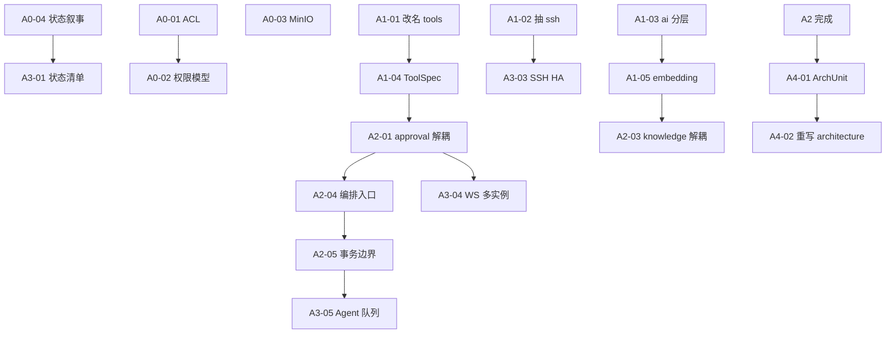

# CloudOps 架构重构任务清单（Agent 执行版）

> 基于 2026-07-22 架构评审结论。  
> 配套 Prompt：`docs/architecture-refactor-prompt.md`  
> 相关但不重复：`docs/agent-optimization-todo.md`（安全/质量优化，OPT-*）  
> 仓库：https://github.com/kamineayaka/CloudOps

## 架构结论（执行前必读）

| 决策 | 说明 |
|------|------|
| **保留** | 单进程模块化单体（Spring Boot）+ 薄 Vue SPA + Compose 单节点主路径 |
| **必须改** | 包边界、命名诚实性、依赖方向、有状态叙事、schema/文档与代码对齐 |
| **现在不做** | 拆微服务、多租户 SaaS 模型、把领域逻辑迁入前端、为“更 MCP”硬接协议层 |

**目标依赖方向（重构后）：**

```
asset / ssh（连接基础设施）
         ↑
      tools（原 mcp，进程内工具注册表）
         ↑
      agent / ai（编排：ReAct、流式会话）
         ↑
   approval（工作流；通过事件/回调回 agent，禁止 Controller 直接调 Agent）
         ↑
 knowledge（检索；embedding 配置走共享 platform，不反向依赖 ai.*）
```

**使用方式：**

1. 阅读 `docs/architecture-refactor-prompt.md`。
2. 按 **A0 → A1 → A2 → A3 → A4** 顺序执行；同阶段内可拆多个 PR，但不得违反依赖方向。
3. 每项单独 commit：`refactor(scope): ARCH-A0-XX 简短说明`。
4. 勾选 `[x]`，PR 引用任务 ID。
5. 本清单**不考虑工程量**；允许大范围包搬迁，但每步必须可编译、可验证。

**任务 ID 前缀：** `ARCH-A0-XX` … `ARCH-A4-XX`

---

## 执行状态总览

| 阶段 | 主题 | 任务数 | 完成 |
|------|------|--------|------|
| A0 | 诚实化：虚构概念落地或删除 | 5 | 0 |
| A1 | 包边界与命名重构 | 6 | 1 |
| A2 | 打破循环依赖 | 5 | 0 |
| A3 | 有状态控制面与扩展路径 | 5 | 0 |
| A4 | 文档、契约与架构守卫 | 4 | 0 |

---

## A0 — 诚实化：落地或删除架构虚构

> 原则：**二选一**。悬空 schema / 文档承诺比没有更糟。

### [ ] ARCH-A0-01 — 资产 ACL：实现或删除 `user_assets`

| 字段 | 内容 |
|------|------|
| **问题** | 表 `user_assets` 存在，无 Entity/Service；OPERATOR 可见全部资产，与 RBAC 设计不符 |
| **决策要求** | PR 描述必须写明选择：**实现** 或 **删除**。默认推荐：**实现**（运维控制面需要资产范围） |
| **若实现** | `UserAsset` 实体 + Repository；ADMIN 全可见；OPERATOR/VIEWER 仅分配资产；`AssetService` / `list_assets` / `ssh_exec` / SSH pool warm 全路径过滤；Admin API 分配/回收；集成测试 |
| **若删除** | Flyway 删除表；文档与 TODO 中移除相关表述；明确“全资产可见”为产品策略 |
| **完成标准** | 代码路径与 schema 一致；无“表在代码无”状态 |
| **依赖** | 无 |

---

### [ ] ARCH-A0-02 — 细粒度权限：接线或收缩 schema

| 字段 | 内容 |
|------|------|
| **问题** | `permissions` / `role_permissions` 已 seed，`PermissionRepository` 未用于鉴权；实际仅 `ROLE_*` |
| **决策要求** | **接线**（`hasAuthority('asset:read')` 等）或 **收缩**（停止假装有细粒度权限：文档改为 Role-only，可选保留表但标注 unused / 删除未用代码路径） |
| **推荐** | 短期：文档与 `@PreAuthorize` 对齐为 Role-only，删除误导性“权限已生效”表述；中期：若做 A0-01，可同步引入少量 authority |
| **完成标准** | 鉴权模型在代码、DB、文档三处一致 |
| **依赖** | 可与 A0-01 同 PR 或紧随其后 |

---

### [ ] ARCH-A0-03 — MinIO：接入附件存储或移出运行时拓扑

| 字段 | 内容 |
|------|------|
| **问题** | Compose/Helm/architecture 声称 MinIO 存附件；backend 无 S3 客户端、无上传 API |
| **若接入** | 对象存储抽象（接口 + MinIO 实现）；附件元数据表；知识库/审计附件上传下载；配置与 `.env.example` |
| **若移出** | 从 `compose.yaml` / Helm values / architecture 图移除 MinIO；文档说明“附件未支持” |
| **推荐** | 近期无附件需求则 **移出**；有需求则完整接入，禁止只留容器 |
| **完成标准** | 拓扑图中的每个中间件都有代码消费者，或已从拓扑删除 |
| **依赖** | 无 |

---

### [ ] ARCH-A0-04 — 纠正“无状态后端”叙事

| 字段 | 内容 |
|------|------|
| **问题** | 文档写 Spring Boot stateless，实际有 `SshConnectionPool`、WS 会话注册表等 JVM 内存状态 |
| **涉及文件** | `docs/architecture.md`、`docs/deployment.md`、`docs/ssh-connection-pool-design.md`、README |
| **实现要点** | 明确标注：**单活有状态控制面**；列出进程内状态清单；说明多副本前提（见 A3） |
| **完成标准** | 文档不再宣称无状态；新人读完不会误以为可随意 `replicas: 2` |
| **依赖** | 无（可先做，为 A3 铺路） |

---

### [ ] ARCH-A0-05 — 清理“模块无循环依赖”虚假声明

| 字段 | 内容 |
|------|------|
| **问题** | `architecture.md` 声称模块无环；实际存在 `ai↔approval`、`ai↔mcp`、`knowledge→ai` |
| **实现要点** | 在 A1/A2 完成前：文档改为“当前存在已知环，目标依赖图见本清单”；A2 完成后改为真实无环描述 + 可选 ArchUnit 守卫（A4） |
| **完成标准** | 文档不撒谎 |
| **依赖** | A2 完成后更新终态描述 |

---

## A1 — 包边界与命名重构

> 大搬迁允许；保持对外 HTTP/WS 路径兼容，除非任务明确要求 breaking change。

### [x] ARCH-A1-01 — 将 `mcp` 重命名为 `tools`（或 `agent.tools`）

| 字段 | 内容 |
|------|------|
| **问题** | 名为 MCP，实为进程内工具注册表，无 MCP 协议 |
| **涉及** | `com.cloudops.mcp.*` → `com.cloudops.tools.*`；类名 `McpTool` → `AgentTool`（或保留接口名但包名改正）；前端/文档所有 “MCP Tool Gateway” 表述改为 “内置工具注册表”；真正的外部 MCP 另见后续可选适配器任务 |
| **完成标准** | 无 `com.cloudops.mcp` 包；README/architecture 不再暗示已实现 MCP 协议 |
| **测试** | 现有工具执行与 Agent 循环回归 |
| **依赖** | 无（建议 A2 前完成，降低改环成本） |

---

### [ ] ARCH-A1-02 — 抽取 `ssh` 包：连接池与拨号不属于 `terminal`

| 字段 | 内容 |
|------|------|
| **问题** | `SshConnectionPool` 挂在 `terminal`，却被 AI / tools / warm API 共用 |
| **目标结构** | `com.cloudops.ssh.pool.*`、`com.cloudops.ssh.dial.*`；`terminal` 仅保留 WebSSH / PTY / WS handler；`SshPoolController` 可迁到 `ssh` 或 `asset` 网关 |
| **完成标准** | `terminal` 不导出被 ai/tools 依赖的池实现；依赖方向：`terminal → ssh`，`tools → ssh`，`ai → ssh` |
| **依赖** | 建议在 A1-01 前后进行；更新 `docs/ssh-connection-pool-design.md` |

---

### [ ] ARCH-A1-03 — 明确 `ai` 包内分层：runtime / agent / api

| 字段 | 内容 |
|------|------|
| **问题** | LLM runtime、ReAct 编排、Provider CRUD、WS 流式混在同一认知边界，导致 knowledge/approval 乱引用 |
| **目标** | 至少逻辑分层（可同模块）：`ai.runtime`（LLM 客户端）、`ai.provider`（配置）、`ai.agent`（ReAct / ToolExecutor）、`ai.api`（Controller/WS）；禁止 knowledge 依赖 `ai.agent` |
| **完成标准** | 包内 README 或 architecture 小节写清分层；跨模块只依赖允许的对外 API |
| **依赖** | A1-01；为 A2 做准备 |

---

### [ ] ARCH-A1-04 — 工具契约与 LLM DTO 解耦

| 字段 | 内容 |
|------|------|
| **问题** | `McpTool` / `ToolRegistry` 依赖 `ai.llm.LlmProvider.ToolDefinition`，tools 向上依赖 ai |
| **实现要点** | 在 `tools`（或中立 `agent.spi`）定义 `ToolSpec`；`ai.agent` 负责映射为 LLM `ToolDefinition` |
| **完成标准** | `tools` 包零 import `com.cloudops.ai.*` |
| **依赖** | A1-01 |

---

### [ ] ARCH-A1-05 — Embedding / Provider 解析抽为共享能力

| 字段 | 内容 |
|------|------|
| **问题** | `knowledge` 直接依赖 `ai.provider` / `ai.runtime` 做 embedding |
| **实现要点** | 抽取 `com.cloudops.platform.llm` 或 `com.cloudops.embedding`：仅暴露 `EmbeddingClient` + 设置读取；`ai` 与 `knowledge` 都依赖该层，互不依赖 |
| **完成标准** | `knowledge` 不再 import `com.cloudops.ai.*` |
| **依赖** | A1-03 建议先做 |

---

### [ ] ARCH-A1-06 — 前端保持薄客户端：禁止领域逻辑下沉

| 字段 | 内容 |
|------|------|
| **问题** | 架构要求 Vue 保持薄 SPA；需防止重构时把风险/审批/Agent 状态机搬进前端 |
| **实现要点** | 审计现有 views：风险展示、审批动作仅调 API；在 `docs/architecture.md` 增加“前端边界”条款；可选 eslint/文档约束；大组件（如 `AiChatView`）可拆 UI，但状态机仍以服务端事件为准 |
| **完成标准** | architecture 写明禁止项；前端无重复实现 RiskClassifier / ApprovalGate |
| **依赖** | 无 |

---

## A2 — 打破循环依赖

### [ ] ARCH-A2-01 — `approval` 不再直接调用 `AiAgentService`

| 字段 | 内容 |
|------|------|
| **问题** | `ApprovalController` / approval 侧反向依赖 ai，形成 `ai ↔ approval` |
| **实现要点** | 审批通过后发布领域事件（Spring `ApplicationEvent` 或接口 `ApprovalDecisionHandler` 由 `ai.agent` 实现）；approval 模块只负责持久化与决策校验 |
| **完成标准** | `approval` 包零 import `com.cloudops.ai.*`；审批后续跑仍可用 |
| **依赖** | A1-03 有助于落点清晰 |

---

### [ ] ARCH-A2-02 — `tools` → `ai` 环消除验证

| 字段 | 内容 |
|------|------|
| **问题** | A1-04 完成后需全仓验证无残留环 |
| **实现要点** | 静态检查（见 A4-01）或脚本 grep；修复遗漏引用 |
| **完成标准** | `tools` ↛ `ai`，`ai` → `tools` 单向 |
| **依赖** | A1-01、A1-04 |

---

### [ ] ARCH-A2-03 — `knowledge` → `ai` 环消除验证

| 字段 | 内容 |
|------|------|
| **问题** | A1-05 后 knowledge 应只依赖 embedding/platform |
| **完成标准** | `knowledge` ↛ `ai`；RAG 索引/检索功能正常 |
| **依赖** | A1-05 |

---

### [ ] ARCH-A2-04 — Agent 编排单一入口

| 字段 | 内容 |
|------|------|
| **问题** | 对话、工具执行、审批续跑、流式推送分散，边界模糊 |
| **实现要点** | 明确 `AgentFacade` / `AiAgentService` 为唯一编排入口；WS、Approval 回调、REST 都进此入口；`ToolExecutorService` 为内部组件 |
| **完成标准** | 外部模块不直接 new/注入工具执行细节；architecture 序列图更新 |
| **依赖** | A2-01 |

---

### [ ] ARCH-A2-05 — 统一应用层事务与长耗时边界

| 字段 | 内容 |
|------|------|
| **问题** | Agent 循环 / SSH / LLM 调用若包在大 `@Transactional` 中，架构上不合理 |
| **实现要点** | 短事务写消息/审批状态；长耗时 LLM/SSH 在事务外；文档化模式 |
| **完成标准** | 关键长事务已拆分；无持有 DB 连接跑完整 ReAct 的路径 |
| **依赖** | A2-04 建议一起做 |

---

## A3 — 有状态控制面与扩展路径

> 仍保持单体；本阶段定义**如何诚实扩展**，而不是立刻拆服务。

### [ ] ARCH-A3-01 — 进程内状态清单与生命周期

| 字段 | 内容 |
|------|------|
| **问题** | 状态分散，无人维护完整清单 |
| **实现要点** | 文档 + 代码注释列出：SSH 池、Terminal WS、AI Stream Registry、其他 `ConcurrentHashMap`；标注失效/驱逐策略 |
| **完成标准** | `docs/architecture.md` 有 “In-process state” 专节 |
| **依赖** | A0-04 |

---

### [ ] ARCH-A3-02 — 单副本部署契约

| 字段 | 内容 |
|------|------|
| **问题** | Helm/Compose 未强制表达单活 |
| **实现要点** | Helm `replicaCount` 默认 1 并注释禁止盲目扩；Compose 文档声明单 backend；可选 readiness 检查 |
| **完成标准** | 运维文档明确：未完成 A3-03/04 前 replicas 必须为 1 |
| **依赖** | A0-04 |

---

### [ ] ARCH-A3-03 — SSH 池外置或粘性会话方案（二选一设计 + 实现）

| 字段 | 内容 |
|------|------|
| **问题** | 多副本下 SSH 池无法共享 |
| **方案 A** | 粘性会话（LB cookie / IP hash）+ 文档约束，池仍每实例本地 |
| **方案 B** | 池元数据外置（Redis）+ 仍本地持有连接（复杂）或集中 SSH gateway 进程 |
| **要求** | 先写 ADR（`docs/adr/0001-ssh-pool-ha.md`），再实现选定方案；**不考虑工程量**，允许引入独立 `ssh-gateway` 模块/进程 |
| **完成标准** | ADR 合并；实现与文档一致；至少一种 HA 路径可演示 |
| **依赖** | A1-02、A3-01 |

---

### [ ] ARCH-A3-04 — AI / Terminal WebSocket 会话的多实例策略

| 字段 | 内容 |
|------|------|
| **问题** | 审批续跑推送、流式输出依赖进程内 registry |
| **实现要点** | Redis Pub/Sub 或 sticky；审批事件可跨实例送达持有 WS 的节点 |
| **完成标准** | 两实例（或模拟）下审批通过仍能推到正确会话；或明确 sticky-only 并强制 LB |
| **依赖** | A2-01、A3-02 |

---

### [ ] ARCH-A3-05 — Agent 执行与 Web 层隔离（线程/队列）

| 字段 | 内容 |
|------|------|
| **问题** | ReAct + SSH + Embedding 与 Web 请求共享 JVM 线程模型，规模化时互相拖死 |
| **实现要点** | 专用线程池 / 工作队列（可先 JVM 内队列，后可迁 Redis/DB outbox）；背压与超时；指标 |
| **完成标准** | Agent 任务不占用 Tomcat 请求线程直到结束；有队列深度指标 |
| **依赖** | A2-05 |

---

## A4 — 文档、契约与架构守卫

### [ ] ARCH-A4-01 — ArchUnit（或等价）依赖规则测试

| 字段 | 内容 |
|------|------|
| **问题** | 重构后易回归出环 |
| **实现要点** | 测试断言：`tools` ↛ `ai`；`approval` ↛ `ai`；`knowledge` ↛ `ai`；`terminal` ↛ `ai`；`ssh` 不依赖 `ai`/`approval` |
| **完成标准** | `./mvnw verify` 含架构测试；违反即失败 |
| **依赖** | A2 基本完成后启用 |

---

### [ ] ARCH-A4-02 — 重写 `docs/architecture.md` 终态

| 字段 | 内容 |
|------|------|
| **问题** | 当前图与模块说明过时 |
| **实现要点** | 更新模块图、依赖方向、状态模型、工具注册表（非 MCP 协议）、部署拓扑、与 OPT 清单关系 |
| **完成标准** | 与代码一致；通过人工对照包结构 |
| **依赖** | A1–A3 主要项完成后 |

---

### [ ] ARCH-A4-03 — API / WS 契约清单

| 字段 | 内容 |
|------|------|
| **问题** | 重构易 silent break 前端 |
| **实现要点** | 维护 `docs/api-contracts.md`：REST 路径、WS 端点、鉴权方式；包搬迁不改契约则标注 compatible |
| **完成标准** | 前端 `src/api/*` 路径均可在契约中找到 |
| **依赖** | 可与 A1 并行维护 |

---

### [ ] ARCH-A4-04 — 与 `agent-optimization-todo.md` 对齐索引

| 字段 | 内容 |
|------|------|
| **问题** | OPT（安全质量）与 ARCH（结构）易重复或冲突 |
| **实现要点** | 在本文件与 OPT 文件顶部互链；标明：ACL/权限类 OPT 若与 A0 重叠，以 ARCH 决策为准，OPT 项改为引用 ARCH ID |
| **完成标准** | 两份 TODO 无矛盾指令 |
| **依赖** | A0 决策落地后 |

---

## 明确不在本清单范围

| 项 | 原因 |
|----|------|
| 拆成 AI / SSH / Approval 微服务 | 状态未外置前只会放大耦合 |
| 多租户 / 多组织 | 产品未定义； interleaves 所有边界 |
| 标准 MCP 协议服务端（stdio/SSE） | 可另立 `docs/` 提案；不等于内置 tools 重命名 |
| Intlayer 等前端 i18n 大迁移 | 与架构无关 |
| 纯样式 / UI redesign | 见其他分支 |

---

## 推荐执行顺序（含并行）



---

## 变更记录

| 日期 | 说明 |
|------|------|
| 2026-07-22 | 初版：架构评审结论完整 TODO（A0–A4），不考虑工程量上限 |
