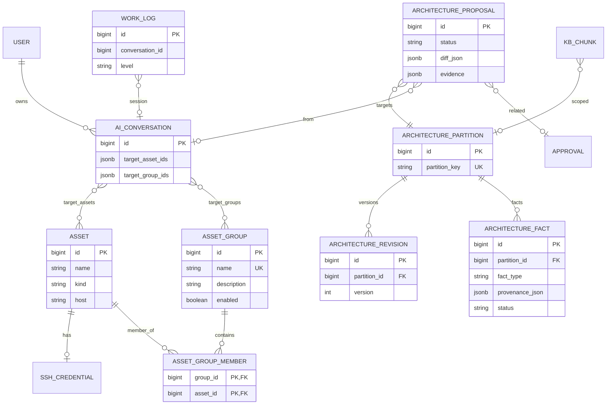

# ArchOps 主线领域模型契约

> 北极星：[`docs/product-vision.md`](product-vision.md)  
> API 草案：[`docs/mainline-api-contracts.md`](mainline-api-contracts.md)  
> 实施计划：[`docs/mainline-implementation-plan.md`](mainline-implementation-plan.md)  
> 品牌与包名：`ArchOps` / `com.archops`

本文是 **ML-\*** 实现的领域契约。后续 PR 不得偏离本文件；变更时先改本文再改代码。

---

## 1. 三大知识对象（愿景 §3）

| 对象 | 领域实体 | 性质 |
|------|----------|------|
| Architecture | `ArchitecturePartition` + `ArchitectureRevision` + `ArchitectureFact` | 组织级 SSOT；默认经 Proposal 合并 |
| Work Log | `WorkLog` | 过程记录；可含 hypothesis；**禁止**隐式拷贝进 SSOT |
| Audit | `AuditLog` | 合规证据；只追加哈希链；默认不进 RAG |

---

## 2. 核心实体

### 2.1 Asset（已有）

- 表：`assets`
- 字段要点：`id, name, kind, host, port, metadata, parent_id, enabled`
- SSH 凭证：`ssh_credentials`（一对一，加密）

### 2.2 AssetGroup（ML-1）

- 表：`asset_group`
  - `id, name`（唯一）、`description`、`enabled`、`created_at`、`updated_at`
- 成员：`asset_group_member(group_id, asset_id)` 联合主键
  - 删除组 → **仅**级联删除成员关系，**不**删除 `assets`
  - 删除资产 → 级联移除成员关系
- 用途：对话目标绑定（如 `Hadoop`）；Architecture 分区键 `group:{id}`

### 2.3 ArchitecturePartition / Revision / Fact（ML-2，契约预留）

**分区键约定（ML-1-05，与 ML-2 对齐）：**

| 键格式 | 含义 |
|--------|------|
| `global` | 全局拓扑与跨组约定 |
| `group:{id}` | 资产组分区（id 为 `asset_group.id`） |
| `asset:{id}` | 单资产分区 |

逻辑上一份 Architecture，物理按上表分区存储。

- `ArchitecturePartition`：`partition_key` UNIQUE、`title`、…
- `ArchitectureRevision`：分区版本（summary、body_md、structured_json、created_by）
- `ArchitectureFact`：结构化事实（ROLE / RUNS / DEPENDS_ON / LABEL 等）
  - **active 事实必须有 provenance**（command / stdout 摘要 / assetId / conversationId / confidence 等）
  - 无 provenance 不得进入 SSOT（愿景 §4.1）

### 2.4 ArchitectureProposal（ML-3，契约预留）

状态机：

```
DRAFT → PENDING_REVIEW → APPROVED | REJECTED | AUTO_MERGED
APPROVED → MERGED
```

- 默认路径：人工确认后合并（愿景 §4.1）
- 窄通道自动合并可配置，默认关闭或极严（ML-3-04）
- 与执行审批解耦，可选 `related_approval_id`

### 2.5 WorkLog（已有雏形，ML-5 升格）

- 追加为主；绑定 `conversation_id` / `asset_ids` / `group_ids` / `level(L0|L1|L2)`
- 晋升为架构事实 **必须** 经 Proposal（愿景 §4.4）

### 2.6 KnowledgeChunk（已有 `kb_chunks`，ML-6 扩展）

- 检索 metadata：`partition_key` / `asset_id` / `group_id` / `source_revision`
- 查询必须可按对话目标范围过滤（愿景 §6）

### 2.7 对话目标（ML-1）

`AiConversation`：

- `target_asset_ids`：显式目标资产
- `target_group_ids`：目标分组
- **有效目标资产并集** = 显式资产 ∪ 各组全部成员（去重）
- 工具默认作用于此并集；显式 `assetId` 若不在并集内 → 拒绝

---

## 3. 事件级别 L0 / L1 / L2（愿景 §4.3）

| 级别 | 含义 | Architecture |
|------|------|--------------|
| **L0** | 只读观察 | 只写 Work Log |
| **L1** | 认知发现 / 修正 | 生成 Proposal（默认人工确认） |
| **L2** | 真实环境变更 | Work Log + 强制 Proposal + 通常执行审批 |

禁止把 L0 提升为架构写入。

---

## 4. ER 草图



---

## 5. 不变量（实现必须遵守）

1. 删除 `AssetGroup` 不得删除 `Asset`。  
2. 进入 SSOT 的事实必须有 provenance。  
3. Work Log → Architecture 只能经 Proposal。  
4. 分区键仅允许 `global` / `group:{id}` / `asset:{id}`。  
5. 对话工具范围默认 = 目标资产并集；越权拒绝。  
6. 前端不实现分类器 / 合并引擎 / 风险门。

---

## 变更记录

| 日期 | 说明 |
|------|------|
| 2026-07-23 | ML-0-02 / ML-1-05：初版领域契约 + 分区键约定 |
