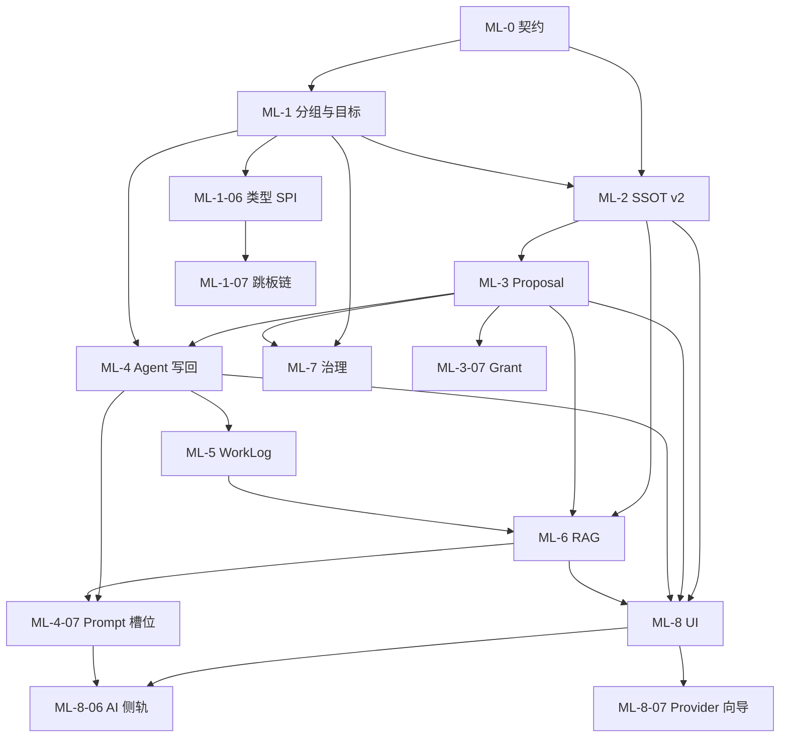

# ArchOps 主线实施计划（Living Architecture + RAG）

> **北极星：** [`docs/product-vision.md`](product-vision.md)  
> **配套 Prompt：** [`docs/mainline-implementation-prompt.md`](mainline-implementation-prompt.md)  
> **竞品学习（OpsKat）：** [`docs/opskat-learning.md`](opskat-learning.md) — 可扩展资产类型、工具治理、上下文槽位、UI 壳；**勿照搬** Description 当架构记忆 / 桌面单用户模型。  
> **相关清单（勿混用）：**  
> - `docs/architecture-refactor-todo.md`（`ARCH-*` 包边界/依赖）  
> - `docs/agent-optimization-todo.md`（`OPT-*` 安全质量）  
> 本清单任务 ID 前缀：**`ML-*`（Mainline）** — 产品主线能力，**不考虑工程量上限**。

## 当前基线（As-Is）

| 能力 | 现状 | 相对愿景的缺口 |
|------|------|----------------|
| 资产 | 扁平资产 + SSH 凭证 | 无分组（如 Hadoop）、无资产级 ACL 落地 |
| Architecture | 单表 `architecture_snapshot`（version + jsonb content） | 无分区、无结构化事实、无 provenance、无提案流 |
| Work Log | 全局近期日志，调度器可写 | 未按会话/Agent 强绑定；未与 L0/L1/L2 对齐 |
| Agent | ReAct + tools + 审批执行 | **执行后不写回 Architecture**；无变更分类 |
| RAG | 对 snapshot/日志/手工文档切块检索 | 无资产/分组范围过滤；上下文仍整段塞 summary |
| 前端 | 聊天、资产、审批、AI 设置 | 无 Architecture 编辑/提案审阅/知识浏览器 |

## 目标闭环（To-Be）

```
资产登记 + 分组
  → 对话绑定目标资产/组
  → Agent 执行（RBAC + 审批）
  → 事件分级 L0/L1/L2
  → L1/L2 产出 Architecture Proposal（带证据）
  → 人确认（或窄自动合并）→ 分区 Architecture 版本合并
  → Work Log 追加（按会话）
  → 异步 RAG 再索引
  → 下轮对话：范围化检索 → 更准的执行
```

## 使用方式

1. 先读 `docs/product-vision.md`（尤其第 4 节难点立场）。  
2. 按 **ML-0 → ML-8** 顺序推进；同阶段可多 PR，但不得跳过标注的硬依赖。  
3. Commit：`feat(scope): ML-3-02 简短说明`。  
4. 勾选 `[x]`；PR 引用 `ML-*`。  
5. 与 `ARCH-*`/`OPT-*` 冲突时：**主线数据模型以本清单为准；包依赖方向以 ARCH 为准；安全默认以 OPT/愿景「先可信再自动」为准。**

---

## 阶段总览

| 阶段 | 主题 | 任务数 | 完成 | 产出 |
|------|------|--------|------|------|
| ML-0 | 对齐与契约 | 4 | 4 | 愿景落地、API/领域契约、成功指标 |
| ML-1 | 资产分组与对话目标 | 7 | 5 | Group、目标绑定、工具范围；**+类型 SPI / 跳板（OpsKat）** |
| ML-2 | Architecture SSOT v2 | 6 | 6 | 分区、结构化事实、版本、出处 |
| ML-3 | Proposal 流水线 | 7 | 6 | 提案→审阅→合并→回滚→审计；**+执行 Grant（OpsKat）** |
| ML-4 | Agent 写回与 L0/L1/L2 | 7 | 6 | 分类器、提案工具；**+Prompt 槽位（OpsKat）** |
| ML-5 | Work Log 一等公民 | 4 | 4 | 会话绑定、晋升规则、索引 |
| ML-6 | RAG 主线化 | 5 | 5 | 范围检索、再索引、反模式消除 |
| ML-7 | 知识治理与权限 | 4 | 4 | ACL、提案审批角色、越权拒绝 |
| ML-8 | 前端体验与可观测 | 7 | 5 | 架构视图、提案 UI；**+AI 侧轨 / Provider 向导（OpsKat）** |

> **ML-0…ML-8 核心主线已落地。** 下列带「OpsKat」标注的 `ML-*-06/07` 为第二波增强，任务状态以勾选为准；设计依据见 [`opskat-learning.md`](opskat-learning.md)。

---

## ML-0 — 对齐与契约

### [x] ML-0-01 — 确认北极星文档进主分支

| 字段 | 内容 |
|------|------|
| **内容** | 合并/保留 `docs/product-vision.md`；README 链到愿景；注明品牌 ArchOps |
| **完成标准** | main 可读愿景；与本计划互链 |
| **依赖** | 无 |

### [x] ML-0-02 — 领域契约：`docs/mainline-domain-model.md`

| 字段 | 内容 |
|------|------|
| **内容** | 书面定义实体：`Asset`、`AssetGroup`、`ArchitecturePartition`、`ArchitectureFact`、`ArchitectureProposal`、`WorkLog`、`KnowledgeChunk`、事件级别 L0/L1/L2、Proposal 状态机 |
| **完成标准** | 后续 PR 实现不偏离该文档；含 ER 草图（mermaid） |
| **依赖** | ML-0-01 |

### [x] ML-0-03 — API/WS 契约草案：`docs/mainline-api-contracts.md`

| 字段 | 内容 |
|------|------|
| **内容** | REST：分组 CRUD、Architecture 分区读写、Proposal CRUD/decide、按会话 WorkLog、范围化 search；WS：Agent 事件中增加 `architecture_proposal` / `work_log_appended` |
| **完成标准** | 前端可按契约 mock；路径风格与现有 `/api/*` 一致 |
| **依赖** | ML-0-02 |

### [x] ML-0-04 — 成功指标与验收剧本

| 字段 | 内容 |
|------|------|
| **内容** | 固化愿景 §11 为可测剧本：Hadoop 三机分组 → 对话发现 NN/DN → Proposal → 合并 → 新会话 RAG 命中角色；错误写入可回滚 |
| **文件** | `docs/mainline-acceptance.md` |
| **完成标准** | 每个后续大阶段结束可对照剧本打勾 |
| **依赖** | ML-0-01 |

---

## ML-1 — 资产分组与对话目标

> 支撑故事：「三台服务器放进 Hadoop 组」。

### [x] ML-1-01 — 数据模型：AssetGroup

| 字段 | 内容 |
|------|------|
| **实现** | Flyway：`asset_group`、`asset_group_member(asset_id, group_id)`；实体/仓库/服务；唯一名；软删除可选 |
| **API** | CRUD 分组；增删成员；列表含成员摘要 |
| **完成标准** | 集成测试覆盖成员约束；删除组不误删资产 |
| **依赖** | ML-0-02 |

### [x] ML-1-02 — 前端：资产分组管理

| 字段 | 内容 |
|------|------|
| **实现** | Assets 页或独立 Groups 页：创建组、拖入/勾选成员、展示成员数 |
| **i18n** | zh-CN / en-US |
| **依赖** | ML-1-01 |

### [x] ML-1-03 — 对话目标：资产 + 分组

| 字段 | 内容 |
|------|------|
| **实现** | `AiConversation` 扩展：`targetAssetIds`（已有）+ `targetGroupIds`；解析为目标资产并集；warm SSH 池覆盖组内成员 |
| **API** | 更新 targets 接口支持 groupIds |
| **完成标准** | 仅选 Hadoop 组即可对组内机器 `ssh_exec` |
| **依赖** | ML-1-01 |

### [x] ML-1-04 — 工具范围：默认落在目标集合

| 字段 | 内容 |
|------|------|
| **实现** | `ssh_exec` / `list_assets`：无显式 assetId 时使用会话目标并集；越权资产拒绝 |
| **完成标准** | 单测：目标外 assetId → BusinessException |
| **依赖** | ML-1-03 |

### [x] ML-1-05 — 分组与 Architecture 分区键对齐

| 字段 | 内容 |
|------|------|
| **实现** | 约定分区键：`global` / `group:{id}` / `asset:{id}`；文档写入领域模型 |
| **依赖** | ML-1-01；为 ML-2 铺路 |

### [ ] ML-1-06 — 资产类型 SPI（OpsKat：双注册表）

| 字段 | 内容 |
|------|------|
| **来源** | OpsKat `internal/assettype` + `frontend/.../assetTypes`；见 `opskat-learning.md` §2 P1 |
| **问题** | 当前资产 kind 偏硬编码；扩展 K8s/未来 DB 需改共享 switch，违反 OCP |
| **后端** | 定义 `AssetTypeHandler`（或等价 SPI）：`type()`、`defaultPort()`、`safeView()`、`validateCreate/Update`、`policyKind()`、凭证解析钩子；`SERVER` / `KUBERNETES`（或现有 kind 枚举）以 `@Component` 自注册；共享代码 **禁止** `switch (kind)` 做类型专属逻辑 |
| **前端** | `registerAssetType({ kind, connectAction, ConfigFields, DetailCard })`；Assets 表单/详情按注册表渲染 |
| **文档** | 新增 `docs/adding-an-asset-type.md`（对标 OpsKat adding-an-asset-type） |
| **完成标准** | 新增第三种类型（哪怕是 stub `DATABASE`）只需新增 Handler + 前端注册文件，不改调度核心；单测覆盖注册发现 |
| **不做什么** | 本任务不实现完整 DB/Kafka GUI |
| **依赖** | ML-1-01 已完成；可与 ML-1-07 并行 |

### [ ] ML-1-07 — Jump / proxy chain（OpsKat：跳板链）

| 字段 | 内容 |
|------|------|
| **来源** | OpsKat `proxy_chain` / sshpool Dialer；见 `opskat-learning.md` §2 P2 |
| **实现** | 资产或 SSH 凭证配置有序跳板：`SSH` 跳板资产引用（可多跳）；可选后续 SOCKS5。拨号逻辑进入统一 `ssh` 拨号层，**终端 WebSSH 与 `ssh_exec` 共用** |
| **API/UI** | 凭证表单可编辑跳板链；详情只读展示 |
| **完成标准** | 经跳板仍能 warm 池 + 终端 + Agent exec；失败有明确错误；审计含最终 assetId |
| **不做什么** | 不把跳板拓扑写进 Architecture SSOT（连接拓扑 ≠ 架构事实，除非用户经 Proposal 声明） |
| **依赖** | 现有 SSH 池；建议 ML-1-06 类型 SPI 中 SSH 类型声明可挂 chain |

---

## ML-2 — Architecture SSOT v2

> 逻辑一份 Architecture，物理分区；结构化事实 + 叙述。

### [x] ML-2-01 — Schema：分区与版本

| 字段 | 内容 |
|------|------|
| **实现** | 表 `architecture_partition(partition_key UNIQUE, title, …)`；`architecture_revision(partition_id, version, summary, body_md, structured_json, created_by, created_at)`；迁移策略：将现有 `architecture_snapshot` 导入 `global` 分区 |
| **完成标准** | 旧数据不丢；`GET` 最新修订可用 |
| **依赖** | ML-0-02、ML-1-05 |

### [x] ML-2-02 — 结构化事实表 `architecture_fact`

| 字段 | 内容 |
|------|------|
| **字段建议** | `id, partition_id, fact_type, subject, predicate, object, asset_id?, confidence, status(active/deprecated), provenance_json, revision_id, created_at` |
| **fact_type 例** | `ROLE`（namenode）、`RUNS`（hive）、`DEPENDS_ON`、`LABEL` |
| **完成标准** | CRUD 服务 + 按 partition/asset 查询；禁止无 provenance 的 active 事实（服务层校验） |
| **依赖** | ML-2-01 |

### [x] ML-2-03 — Architecture 读写 API v2

| 字段 | 内容 |
|------|------|
| **实现** | 列表分区；获取某分区最新修订+活跃事实；人工直接编辑（ADMIN）创建新 revision（乐观锁 version） |
| **废弃** | 旧单快照 API 标记 deprecated 或适配层转发到 `global` |
| **依赖** | ML-2-01、ML-2-02 |

### [x] ML-2-04 — 统一视图组装

| 字段 | 内容 |
|------|------|
| **实现** | `ArchitectureViewService`：按对话目标组装「相关分区」视图（目标资产/组 ∪ global）；输出给 Agent context 与前端 |
| **完成标准** | 未绑定目标时仍可读 global；绑定 Hadoop 时优先 group+成员资产分区 |
| **依赖** | ML-2-03、ML-1-03 |

### [x] ML-2-05 — 版本回滚

| 字段 | 内容 |
|------|------|
| **实现** | `POST /api/architecture/partitions/{key}/rollback` 到指定 version（复制为新 revision 或指针）；事实表与 revision 一致恢复；触发 reindex |
| **审计** | 记录操作者与 from/to version |
| **依赖** | ML-2-03 |

### [x] ML-2-06 — 并发控制

| 字段 | 内容 |
|------|------|
| **实现** | 更新/合并带 `baseVersion`；冲突返回 `ARCHITECTURE_VERSION_CONFLICT`；禁止无版本全量覆盖 |
| **测试** | 并发写冲突用例 |
| **依赖** | ML-2-03 |

---

## ML-3 — Architecture Proposal 流水线

> **默认提议，不静默覆盖**（愿景 4.1）。

### [x] ML-3-01 — Proposal 状态机与存储

| 字段 | 内容 |
|------|------|
| **状态** | `DRAFT` → `PENDING_REVIEW` → `APPROVED` / `REJECTED` / `AUTO_MERGED`；`APPROVED` → `MERGED` |
| **表** | `architecture_proposal`：partition_key、diff_json、fact_ops[]、evidence[]、risk、confidence、requester、reviewer、conversation_id、status、base_version |
| **依赖** | ML-2-02 |

### [x] ML-3-02 — 提交与审阅 API

| 字段 | 内容 |
|------|------|
| **API** | 创建提案；列表（按状态/分区）；详情含 diff；`decide(approve/reject)` |
| **规则** | 批准者 ≠ 提案者（与执行审批四眼原则对齐）；高影响分区可要求 ADMIN |
| **依赖** | ML-3-01 |

### [x] ML-3-03 — Merge 引擎

| 字段 | 内容 |
|------|------|
| **实现** | 将 fact_ops 应用到 fact 表 + 生成新 revision body/summary；校验 baseVersion；写审计；发领域事件 `ArchitectureMerged` |
| **完成标准** | 合并后 `ArchitectureView` 立即可见新事实 |
| **依赖** | ML-3-02、ML-2-06 |

### [x] ML-3-04 — 窄通道自动合并策略

| 字段 | 内容 |
|------|------|
| **实现** | 配置 `archops.architecture.auto-merge`：允许的 fact_type、最小 confidence、必须字段（command、stdoutHash、assetId）；不满足则降级 PENDING_REVIEW |
| **默认** | **关闭或极严**；文档说明如何渐进放开 |
| **依赖** | ML-3-03 |

### [x] ML-3-05 — 提案与执行审批解耦但可关联

| 字段 | 内容 |
|------|------|
| **实现** | Proposal 可选 `related_approval_id`；L2 真实变更：先命令审批，再架构提案（或同会话串联） |
| **完成标准** | 文档写清两种治理对象差异 |
| **依赖** | ML-3-02 |

### [x] ML-3-06 — 事件：合并后触发 RAG

| 字段 | 内容 |
|------|------|
| **实现** | 监听 `ArchitectureMerged` → 仅该分区 reindex（非全库） |
| **依赖** | ML-3-03；对接 ML-6 |

### [ ] ML-3-07 — 执行 Grant + decision_source（OpsKat：权限记忆）

| 字段 | 内容 |
|------|------|
| **来源** | OpsKat `internal/ai/permission` + grant_sessions；见 `opskat-learning.md` §2 P1 工具治理 |
| **问题** | 同类低风险命令反复审批，体验差；审计缺少「为何放行」 |
| **实现** | 1) 审批通过时可勾选「本会话记住」→ 写入 `execution_grant`（userId、assetId/scope、pattern、TTL、conversationId）；2) `ToolExecutor` / ApprovalGate 先匹配 grant 再走完整审批；3) 审计字段 `decision_source` = `AUTO_POLICY` \| `USER_APPROVAL` \| `GRANT` \| `DENY`；4) grant **不得**绕过知识 Proposal 门（只覆盖执行类工具） |
| **安全** | HIGH 风险默认不可 grant；grant 绑定用户与资产范围；过期即失效 |
| **完成标准** | 集成测试：同会话二次同类命令走 GRANT；跨用户/跨资产不命中；审计可查询 source |
| **依赖** | 现有 Approval 流水线；与 ML-7 权限模型兼容 |

---

## ML-4 — Agent 写回与 L0/L1/L2

### [x] ML-4-01 — 执行事件模型

| 字段 | 内容 |
|------|------|
| **实现** | 每次工具结果规范化为 `ToolExecutionEvent`：tool、args、stdout/stderr 摘要、exitCode、assetIds、conversationId、timestamp |
| **落库** | 可进 Work Log 明细或独立表，供 provenance 引用 |
| **依赖** | ML-5 可并行，但 provenance 需要稳定 ID |

### [x] ML-4-02 — ChangeClassifier（L0/L1/L2）

| 字段 | 内容 |
|------|------|
| **实现** | 规则 +（可选）LLM 辅助：默认偏保守（不确定 → L0 或 L1+PENDING）；输出 classification + rationale |
| **位置** | `knowledge` 或 `ai.agent` 内服务；**禁止**前端分类 |
| **测试** | 用例表：`df -h`→L0；发现 namenode→L1；扩容节点→L2 |
| **依赖** | ML-4-01 |

### [x] ML-4-03 — Agent 工具：`propose_architecture_update`

| 字段 | 内容 |
|------|------|
| **实现** | 新 `AgentTool`：参数含 partition、facts[]、evidence refs、summary；内部创建 Proposal；返回 proposalId |
| **风险** | MEDIUM/HIGH → 可走执行审批或仅知识审批（按配置） |
| **依赖** | ML-3-02、ML-4-02 |

### [x] ML-4-04 — ReAct 后处理钩子

| 字段 | 内容 |
|------|------|
| **实现** | 每轮工具执行后跑 Classifier；L1/L2 时 **提示/强制** 模型调用 `propose_architecture_update`（system prompt + 工具描述）；若模型未调用且 L2，系统可自动生成草稿 Proposal |
| **完成标准** | Hadoop 剧本中至少产生一条含 NN/DN 的 PENDING 提案 |
| **依赖** | ML-4-02、ML-4-03 |

### [x] ML-4-05 — System Prompt / 工具策略更新

| 字段 | 内容 |
|------|------|
| **实现** | `AiAgentService` SYSTEM_PROMPT：先检索已知架构 → 再探测；L0 不写架构；发现角色必须提案；写明分区键规则 |
| **依赖** | ML-2-04、ML-4-03 |

### [x] ML-4-06 — 流式 UI 事件

| 字段 | 内容 |
|------|------|
| **实现** | WS 推送 `architecture_proposal_created`；聊天区可展示「待审架构更新」卡片，链到提案详情 |
| **依赖** | ML-3-02、ML-8-02（可先后端事件） |

### [ ] ML-4-07 — Prompt 槽位组装（OpsKat：PromptBuilder 模式）

| 字段 | 内容 |
|------|------|
| **来源** | OpsKat `PromptBuilder` / openTabs / mention；见 `opskat-learning.md` §2 P1 上下文 |
| **原则** | **学槽位，换内容** — 禁止把资产 Description 当架构 SSOT |
| **实现** | `AgentContextAssembler`（或扩展 `KnowledgeContextService`）按固定槽位拼接：① 身份与安全规则；② 对话目标（资产/组）；③ 范围化 RAG Top-K；④ 活跃 Architecture facts；⑤ 相关 Work Log 摘要；⑥（可选）前端上报的 openSurface（当前页：terminal/architecture/approvals）；⑦ 密钥/越权警示 |
| **前端** | 聊天/布局可上报 `uiContext`（当前路由、选中资产）；仅作提示，权威仍以服务端目标与 ACL 为准 |
| **完成标准** | 单测：给定目标和假 RAG/facts，输出槽位齐全且无整本 Architecture dump；token 上限可配置 |
| **依赖** | ML-2-04、ML-6-02 已完成 |

---

## ML-5 — Work Log 一等公民

### [x] ML-5-01 — 会话/Agent 绑定

| 字段 | 内容 |
|------|------|
| **实现** | `work_log` 增加 `conversation_id`、`user_id`、`asset_ids`、`group_ids`、`level(L0/L1/L2)`、`hypothesis` 标记 |
| **写入点** | Agent 每轮摘要；工具执行摘要；禁止调度器伪造业务发现除非标明 `source=scheduler` |
| **依赖** | ML-4-01 |

### [x] ML-5-02 — API：按会话/资产查询日志

| 字段 | 内容 |
|------|------|
| **实现** | `/api/knowledge/work-logs?conversationId=&assetId=&groupId=` |
| **依赖** | ML-5-01 |

### [x] ML-5-03 — 日志晋升为架构事实

| 字段 | 内容 |
|------|------|
| **实现** | 仅通过创建 Proposal（引用 work_log_id 作 evidence）；**禁止**隐式拷贝日志进 SSOT |
| **依赖** | ML-3-01、ML-5-01 |

### [x] ML-5-04 — 索引策略

| 字段 | 内容 |
|------|------|
| **实现** | 日志 chunk 带 metadata：conversationId、assetIds、level；低价值 L0 可采样索引或缩短 TTL |
| **依赖** | ML-6-01 |

---

## ML-6 — RAG 主线化

### [x] ML-6-01 — Chunk metadata 与过滤

| 字段 | 内容 |
|------|------|
| **实现** | `kb_chunks` 扩展 metadata（partition_key、asset_id、group_id、source_revision）；`retrieve(query, scope)` |
| **完成标准** | 绑定 Hadoop 时检索不串到无关分区（可用集成测试植入向量验证过滤） |
| **依赖** | ML-2-01 |

### [x] ML-6-02 — 替换「整本 summary 塞 prompt」

| 字段 | 内容 |
|------|------|
| **实现** | `KnowledgeContextService`：改为「短全局摘要 + 范围化 Top-K chunks + 相关活跃 facts 列表」；配置 max tokens |
| **依赖** | ML-2-04、ML-6-01 |

### [x] ML-6-03 — 分区增量 reindex

| 字段 | 内容 |
|------|------|
| **实现** | `reindexPartition(key)`；合并/回滚只刷分区；保留全量 reindex 给 ADMIN |
| **依赖** | ML-3-06 |

### [x] ML-6-04 — 向量索引健康

| 字段 | 内容 |
|------|------|
| **实现** | 确保 embedding 索引存在（承接 OPT-P0-01）；监控 chunk 数、失败队列 |
| **依赖** | 可与 OPT 对齐 |

### [x] ML-6-05 — 「先检索再探测」可观测

| 字段 | 内容 |
|------|------|
| **实现** | 记录每轮 RAG hit 数、是否跳过重复探测（日志/指标）；用于验收剧本 |
| **依赖** | ML-6-02 |

---

## ML-7 — 知识治理与权限

### [x] ML-7-01 — 资产范围 ACL（与 OPT/ARCH-A0 统一）

| 字段 | 内容 |
|------|------|
| **实现** | 落地 `user_assets` 或等价；分组权限：成员可见或组级授权 |
| **规则** | Agent 只能对有权资产/组提案；检索同样过滤 |
| **依赖** | ML-1；与 `ARCH-A0-01`/`OPT-P0-06` 合并决策，避免重复实现 |

### [x] ML-7-02 — 知识读权限矩阵

| 字段 | 内容 |
|------|------|
| **实现** | VIEWER：只读授权范围内 Architecture/日志/RAG；OPERATOR：可提案；ADMIN：直接编辑+回滚+全量 reindex |
| **依赖** | ML-2-03、ML-3-02、ML-7-01 |

### [x] ML-7-03 — 提案批准权限

| 字段 | 内容 |
|------|------|
| **实现** | 默认 OPERATOR 可批非本人提案；`global` 或标记 `high_impact` 分区仅 ADMIN；自批拒绝 |
| **依赖** | ML-3-02 |

### [x] ML-7-04 — 审计覆盖

| 字段 | 内容 |
|------|------|
| **实现** | 提案创建/批准/拒绝/合并/回滚/直接编辑全部进 audit hash chain |
| **依赖** | ML-3-03、ML-2-05 |

---

## ML-8 — 前端体验与可观测

### [x] ML-8-01 — Architecture 浏览器

| 字段 | 内容 |
|------|------|
| **实现** | 分区列表、修订历史、活跃事实表、Markdown 正文；ADMIN 编辑 |
| **依赖** | ML-2-03 |

### [x] ML-8-02 — Proposal 审阅台

| 字段 | 内容 |
|------|------|
| **实现** | 待审列表、diff/facts/evidence、一键批准/拒绝；聊天内入口 |
| **依赖** | ML-3-02、ML-4-06 |

### [x] ML-8-03 — 对话侧知识提示

| 字段 | 内容 |
|------|------|
| **实现** | 展示本轮 RAG 引用（可折叠）；显示目标组/资产；提案卡片 |
| **依赖** | ML-6-02、ML-1-03 |

### [x] ML-8-04 — 主线演示剧本自动化/半自动

| 字段 | 内容 |
|------|------|
| **实现** | `docs/mainline-acceptance.md` 逐步可执行；可选集成测试或脚本 seed 三机分组 |
| **依赖** | ML-4-04、ML-3-03、ML-6-02 |

### [x] ML-8-05 — 产品指标仪表

| 字段 | 内容 |
|------|------|
| **指标例** | `archops_architecture_proposals_pending`、`merged_total`、`rag_hits_per_chat`、`auto_merge_total`、`rollback_total` |
| **依赖** | 各后端埋点 |

### [ ] ML-8-06 — 布局：资产树 + 主区 + AI 侧轨（OpsKat：工作台壳）

| 字段 | 内容 |
|------|------|
| **来源** | OpsKat App shell（Sidebar / LeftPanel / MainPanel / SideAssistantPanel）；见 `opskat-learning.md` §2 P2 |
| **实现** | 1) 资产树（组→成员）可导航；2) 主区保留现有路由页；3) **可钉住的 AI 助手侧轨**：在 Terminal / Assets / Architecture 页旁打开同一会话 Agent，不必只能进独立 `/ai` 全页；4) 侧轨支持缩小/展开，状态可持久到 localStorage（仅 UI） |
| **完成标准** | 终端操作时侧轨可同时对话；侧轨复用现有 AI WS/API；移动端降级为抽屉或全页 |
| **不做什么** | 不移植 Wails Tab 体系；不做 RDP/VNC |
| **依赖** | ML-1 分组 UI；现有 AiChat；建议与 ML-4-07 uiContext 联动 |

### [ ] ML-8-07 — AI Provider 首次向导 / 测连通（OpsKat：Setup UX）

| 字段 | 内容 |
|------|------|
| **来源** | OpsKat `AISetupWizard` / Provider 表单；见 `opskat-learning.md` §2 P2 |
| **实现** | 无可用 Provider 时引导向导：选类型 → 填 Base URL/Key → **Test connection** → 拉模型列表 → 设默认；失败展示可读错误；密钥始终脱敏 |
| **完成标准** | 新部署 5 分钟内可完成首 Provider；与现有 AI Settings 页共存不重复存两套配置 |
| **依赖** | 现有 AiProvider API |

---

## ML-OpsKat 第二波：待办汇总

| ID | 标题 | 状态 |
|----|------|------|
| ML-1-06 | 资产类型 SPI | [ ] |
| ML-1-07 | Jump / proxy chain | [ ] |
| ML-3-07 | 执行 Grant + decision_source | [ ] |
| ML-4-07 | Prompt 槽位组装 | [ ] |
| ML-8-06 | AI 侧轨工作台壳 | [ ] |
| ML-8-07 | Provider 首次向导 | [ ] |

推荐实施顺序：`ML-1-06` →（`ML-1-07` ∥ `ML-8-07`）→ `ML-4-07` → `ML-3-07` → `ML-8-06`。

---

## 推荐依赖图



## 明确不在本主线清单

- 拆微服务 / 多租户 SaaS  
- 标准 MCP 协议服务器（内置 tools 足够支撑主线）  
- 纯 UI redesign（不阻塞主线可后置）  
- 将 ARCH 包搬迁与本清单绑死（可并行，但 ML 功能优先可编译交付）  
- **照搬 OpsKat：** Description 当架构记忆、桌面 Unix socket 审批、三套 SSH 连接路径、一次性做齐 DB/RDP/Kafka GUI（详见 `opskat-learning.md` §3）

## 与现有清单的协作规则

| 若涉及 | 处理 |
|--------|------|
| `user_assets` / 权限 | 在 ML-7-01 一次做完，勾掉对应 OPT/ARCH 重复项并互链 |
| RAG 向量索引缺失 | 并入 ML-6-04 或先做 OPT-P0-01 |
| `mcp`→`tools` 已完成 | 新工具加在 `com.archops.tools` |
| 产品愿景变更 | 先改 `product-vision.md`，再改本计划 |
| OpsKat 启发项 | 以本清单 `ML-*-06/07` 为准；实现前重读 `opskat-learning.md`「不要照搬」 |

---

## 变更记录

| 日期 | 说明 |
|------|------|
| 2026-07-22 | 初版：基于 ArchOps 愿景的详尽主线实施计划 ML-0…ML-8 |
| 2026-07-23 | ML-0 完成：愿景互链 + 领域/API/验收文档 |
| 2026-07-23 | ML-1 完成：AssetGroup、对话目标组、工具范围、分区键约定 |
| 2026-07-23 | ML-2…ML-8：SSOT/Proposal/Agent 写回/WorkLog/RAG/ACL/前端与指标 |
| 2026-07-23 | OpsKat 第二波：正式纳入 ML-1-06/07、ML-3-07、ML-4-07、ML-8-06/07 |
